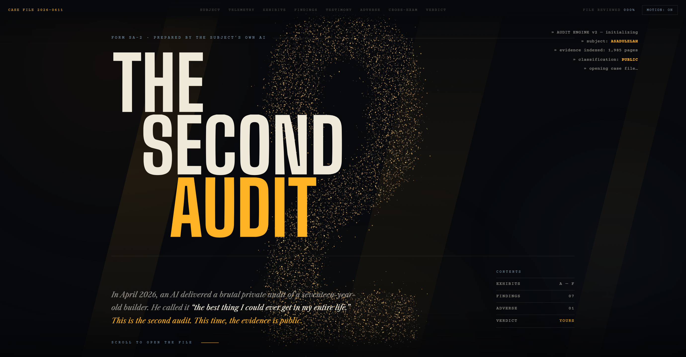

# THE SECOND AUDIT

**A portfolio written as a forensic audit of its own subject — conducted by his AI.**

**Live: [the-second-audit.vercel.app](https://the-second-audit.vercel.app)**



---

## The premise

In April 2026, I asked my own AI for a no-sugar-coating audit of my life and work. It delivered. I called it the best thing I ever received.

This site is the second audit — same auditor, public evidence. It is not a portfolio that *claims* things; it is a case file that *presents* them. You are not the reader. You are the juror: the file tracks how much of it you've reviewed, the evidence reacts as you examine it, and at the end you type the verdict yourself and stamp it onto the page.

It even includes **adverse findings** — the section no portfolio has. An audit that hides findings is an advertisement. This page is not an advertisement.

## What's inside

- **A particle narrative engine** — one WebGL field (~15,000 particles, custom shaders) tells the whole story by transforming at every act: chaos → the case-number sigil → a starfield → a ring that spins faster with each collapse → the ring shattering into an exit line at the diagnosis → the word **"YOURS."** at the verdict.
- **A scroll film** — pinned narrative scenes, a horizontal telemetry wall of counting numbers, 3D-tilting exhibits, a six-phase pinned climax.
- **Components that demonstrate their claims instead of describing them** — a labeled agent cursor that visibly *operates* the CRM mock (clicks rows, ticks counters, writes its own log); a packet-flow diagram where one packet fails, retries, and recovers; a dossier whose fields type themselves in before a VERIFIED stamp slams the corner; a living knowledge-graph canvas; a WhatsApp pipeline with a real typing indicator.
- **A game layer** — FILE REVIEWED %, per-section ✓ marks, and a typed verdict with screen-shake and a particle burst.
- **An explicit MOTION toggle** — cinematic by default, fully readable with motion off.

## Stack

Deliberately boring: **vanilla HTML/CSS/JS + [Three.js](https://threejs.org) + [GSAP ScrollTrigger](https://gsap.com)**, loaded from CDN. No framework, no bundler, no build step.

```
index.html        the case file (all nine scenes)
style.css         the design system — carbon void, bone, forensic amber;
                  Courier Prime (court documents are literally set in Courier),
                  Big Shoulders (stenciled evidence-crate caps), Libre Caslon (testimony)
app.js            particle engine + scroll film + game layer
components.css    the component-craft layer (dossier, stamps, tags, phone, terminal…)
components.js     component behaviors (agent cursor, type-in, graph, sequences)
```

## Run it

```bash
npx serve .        # or just open index.html
```

Deploy is one command from this folder: `vercel deploy --prod`.

## Provenance

Researched, written, designed and built by my AI from my second brain — a 1,985-page knowledge system it maintains. I did not write a word of the copy on the page; the receipts it cites (332,378 lines of TypeScript, 68 agent tools, 1,700 leads verified in 7 days) come from audited repositories and production systems.

The auditor presents. The reader rules.

## License

[MIT](LICENSE) — take the mechanisms, but make your own case file. The conceit only works if it's true.

---

**Asadulelah** · [GitHub](https://github.com/Asadulelah) · [Instagram](https://instagram.com/asadulelah.ai) · [LinkedIn](https://www.linkedin.com/in/asadulelah/)
